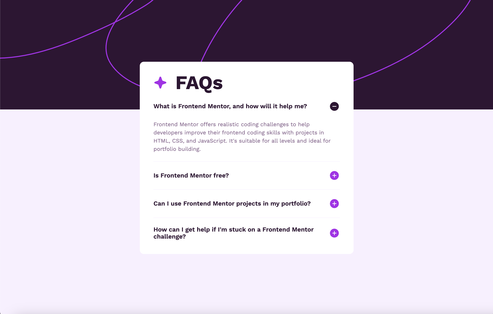

# Frontend Mentor - FAQ accordion solution

This is a solution to the [FAQ accordion challenge on Frontend Mentor](https://www.frontendmentor.io/challenges/faq-accordion-wyfFdeBwBz). Frontend Mentor challenges help you improve your coding skills by building realistic projects. 

## Table of contents

- [Overview](#overview)
  - [The challenge](#the-challenge)
  - [Screenshot](#screenshot)
  - [Links](#links)
- [My process](#my-process)
  - [Built with](#built-with)
  - [What I learned](#what-i-learned)
  - [Continued development](#continued-development)
  - [Useful resources](#useful-resources)
- [Author](#author)
- [Acknowledgments](#acknowledgments)

## Overview

### The challenge

Users should be able to:

- Hide/Show the answer to a question when the question is clicked
- Navigate the questions and hide/show answers using keyboard navigation alone
- View the optimal layout for the interface depending on their device's screen size
- See hover and focus states for all interactive elements on the page

### Screenshot



### Links

- Solution URL: [https://github.com/hackz101/faq-accordion-main](https://github.com/hackz101/faq-accordion-main)
- Live Site URL: [https://faq-accordion-main-mu-sand.vercel.app/](https://faq-accordion-main-mu-sand.vercel.app/)

## My process

### Built with

- Semantic HTML5 markup
- CSS custom properties
- CSS Grid
- Javascript
- Responsive Design
- [Normalize.css](https://necolas.github.io/normalize.css/) - For CSS resets

### What I learned

Here are some of the things that I learned throughout this project:

1. **When editing an element's innerHTML, its parent element gets destroyed and then recreated.**
This was an issue at first because my event event listeners were getting destroyed. I was only 
able to fire them once. To fix this, I used insertAdjacentHTML instead:

```html
<section>
  <div class="faq-header-group">
    <h2 class="faq js-faq-question" tabindex="0">FAQ GOES HERE</h2>
    
  </div>
  ... paragraph will appear here
</section>
```
```js
if (isExpanded !== true) {
  section.insertAdjacentHTML('beforeend', getParagraphBySectionId(index));
  expandButton.src = '/assets/images/icon-minus.svg';
} else {
  section.removeChild(section.querySelector('p'));
  expandButton.src = '/assets/images/icon-plus.svg';
}
```

2. **A conditional variable must be set inside the closure's function to be re-evaluated.**
My calls to grab the class list of the button to see if they were expanded were not updating.
This was due to the fact that because the variable declared outside of the event listener, it
was evaluating and passing the saved value from the closure. To fix this, I just needed to move
the declaration into the event listener so that it evaluates each time a click happens:

==Before==
```js
/*handle expand button*/
const isExpanded = expandButton.classList.contains('js-section-expanded');
...
expandButton.addEventListener('click', () => {
  toggleExpansion(section, index, expandButton, isExpanded);
});
```

==After==
```js
/*handle expand button*/
...
expandButton.addEventListener('click', () => {
  const isExpanded = expandButton.classList.contains('js-section-expanded');
  toggleExpansion(section, index, expandButton, isExpanded);
});
```

3. **If an element is unfocusable, you can add the tabIndex attribute with a 0 or positive integer.**
The challenge stated that the accordion should also be controllable by the keyboard. However, I 
also ran into an issue where the headers were not focusable. I found out that to do this you 
just needed to add the tabIndex attribute with a 0 or positive integer for it to become focusable:

```html
<h2 class="faq js-faq-question" tabindex="0">FAQ GOES HERE</h2>
```

4. **To find the element that is being focused on, you can use the document's activeElement property.**
At first, I was unsure of how to exactly get the focused element. I figured it would be some sort
of event, but after searching on google, I found that you can just use document.activeElement.

5. **Try setting grid parent height to 100% and using min-height on a grid if the content outside is overlapping with it.**
I was having an issue where the attribution at the bottom of the page would overlap with the grid
content when the FAQs were fully expanded. I originally had the container (grid) height set to
100dvh so that the content was centered. However, it seems that grid content can expand past its
bounds if the content is large enough and the parent's height is not defined. Therefore the 
content was overlapping with the attribution. All I had to do was change the min-height of the 
container to be 100svh and set the body to a height of 100%.

### Continued development

I want to continue improving on the following areas:
  - Making grid layouts work smoothly
  - Understanding how parent-child element size affects each other

## Author

- Frontend Mentor - [@hackz101](https://www.frontendmentor.io/profile/hackz101)